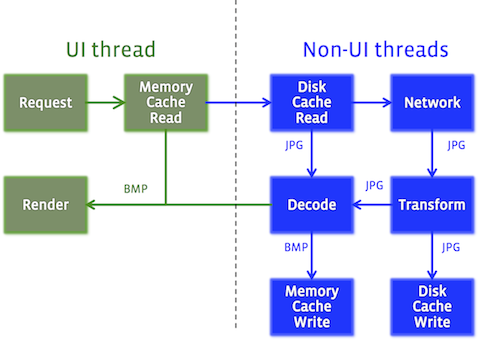

The image pipeline does everything necessary to get an image into a form where it can be rendered into an Android device.

The pipeline goes through the following steps when given an image to load:

1. Look in the bitmap cache. If found, return it.
2. Hand off to other threads.
3. Check in the encoded memory cache. If found, decode, transform, and return it. Store in the bitmap cache.
3. Check in the disk cache. If found, decode, transform, and return it. Store in the encoded-memory and bitmap caches.
4. Check on the network (or other original source). If found, decode, transform, and return it. Store in all three caches.

This being an image library, an image is worth a thousand words:

(The 'disk' cache as pictured includes the encoded memory cache, to keep the logic path clearer.) See [this page](caching.html) for more details on caching.

The pipeline can read from [local files](supported-uris.html) as well as network. PNG, GIF, and WebP are supported as well as JPEG.

### WebP on older platforms

WebP is often a useful image format, but Android did not support it at all until Android 3.0. Extended WebP format was not supported until Android 4.1.2.

The image pipeline transcodes unsupported WebP images into JPEG for you. This allows you to use WebP in your app all the way back to Android 2.3.
